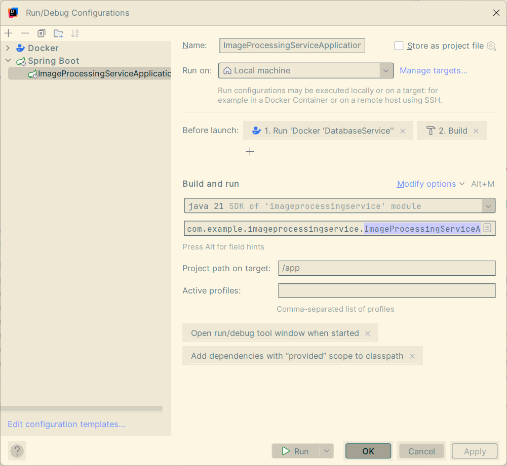

### 🖼️ Image Processing Service

Welcome to the backend powerhouse that chews on images, digests them,
and spits out exactly what you asked for --- resized, rotated, filtered,
or just safely tucked into a database.

------------------------------------------------------------------------

### 📖 Docs

-   **Raw JSON OpenAPI spec:**
    [http://server:port/v3/api-docs](http://server:port/v3/api-docs)\
-   **Human-friendly Swagger UI:**
    <http://localhost:8080/swagger-ui/index.html>

------------------------------------------------------------------------

### 🚀 Running the Project

The whole thing is dockerized, so you don't have to summon any local
dependency demons. By default, it runs with Docker Compose.

Spin it up from the project directory with:

``` bash
docker compose -f docker-compose.yml   -p imageprocessingservice up -d --build
```

I've also set up an IntelliJ IDEA run configuration for convenience:\


For faster builds, this project uses **BuildKit** magic:\
https://docs.docker.com/build/buildkit/

There's also a handy init script at `db/init/init.sql` which sets up the
database and seeds it with some starting data.\
*(In the next version, this whole init process will be automated ---)*

------------------------------------------------------------------------

### 🔐 API Examples(Basic Auth Required)

#### Add an Image to the DB

``` bash
curl -X POST 'http://localhost:8080/api/images'   --header 'Content-Type: multipart/form-data'   --form file=@/path/to/image.jpeg;type=image/jpeg   --user 'username:secret'
```

#### Fetch an Image

``` bash
curl -X GET 'http://localhost:8080/api/images/1'   --user 'username:secret'
```

#### Transform an Image

``` bash
curl -X POST 'http://localhost:8080/api/images/1/transform'   --header 'Content-Type: application/json'   --data '{
  "resize": { "width": 800, "height": 600 },
  "rotate": 90,
  "format": "png",
  "filters": { "grayscale": true, "sepia": false },
  "saved": false
}'   --user 'username:secret'
```
